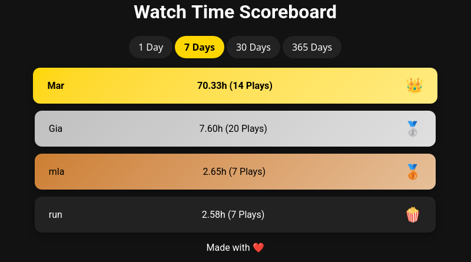

# Tautulli Scoreboard

 

TODO

## Screenshots


</img>

## Build

To build the container yourself, simply clone the repository and then build the container with the provided docker file. You can the run it as described in the section below.

```shell
docker build --tag tautulli-scoreboard .
```

Alternatively you can build the binary directly with Go.

```shell
go build -o ./tautulli-scoreboard
```

## Run

The easiest way to run this, is to use the provided container.

```shell
docker run -d \
  -e TS_BASE_URL="https://tautulli.yourdomain.com" \
  -e TS_API_TOKEN="123" \
  -p 8080:8080 \
  ghcr.io/masterevarior/tautulli-scoreboard:latest
```

You should now see the UI at http://localhost:8080

### Environment Variables

| Name             | Description                                                | Default                                                                                 | Example             | Mandatory  |
|------------------|------------------------------------------------------------|-----------------------------------------------------------------------------------------|---------------------|------------|
| TS_BASE_URL      | The Path to your directory where all your repositories are |                                                                                         | `https://tautulli.yourdomain.com`| ✅         |
| TS_API_TOKEN     | Tautulli API token                                         |                                                                                         | `apcd123`           | ✅         |
| TS_TITLE         | Title that should be displayed                             | Watch Time Scoreboard                                                                   | My cool title       | ❌         |
| TS_FOOTER        | Content of the footer                | Made with ❤️ | My cool footer      | ❌         |
| TS_PORT          | Port                                                       | `:8080`                                                                                 | `:8455`             | ❌         |

## Development

### Linting

Linting is done with [golangci-lint](https://golangci-lint.run/), which can be run like so:

```shell
golangci-lint run
```

Run all other linters with the treefmt command. Note that the command does not install the required formatters.

```shell
treefmt
```

### Git Hooks

There are some hooks for formatting and the like. To use those, execute the following command:

```shell
git config --local core.hooksPath .githooks/
```

### Nix

If you are using [NixOS or the Nix package manager](https://nixos.org/), there is a dev shell available for your convenience. This will install Go, everything needed for formatting, set the Git hooks and some default environment variables. Start it with this command:

```shell
nix develop
```

If you happen to use [nix-direnv](https://github.com/nix-community/nix-direnv), this is also supported.

## Improvements, issues and more

Pull requests, improvements and issues are always welcome.
